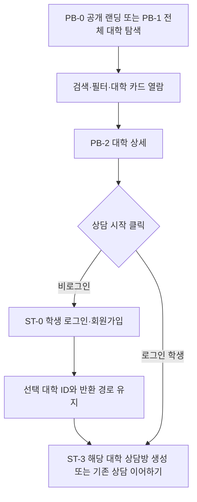
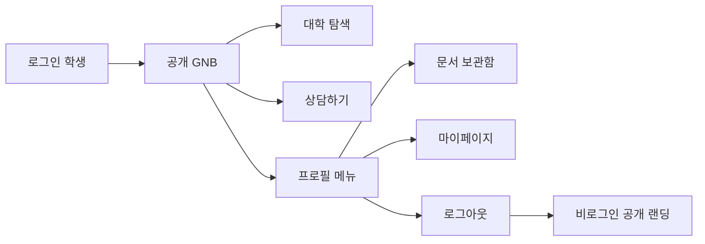
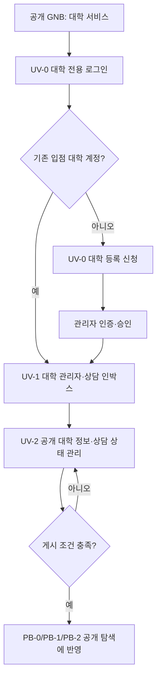
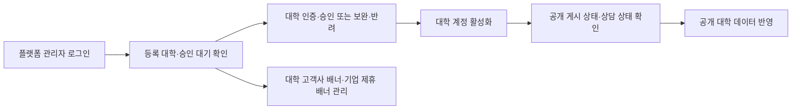

# UniChat — IA·플로우·정책 개선안

> **원본 복사 기준:** [`../02_상담시스템_IA_플로우.md`](../02_상담시스템_IA_플로우.md) (유학생 상담 플랫폼 — IA·플로우 v3)  
> **개정 목적:** 원본은 보존하고, 2026-07-21 기준의 UniChat 공개 대학 탐색 서비스와 역할별 진입 정책을 반영한다.  
> **목업 적용 폴더:** `랜딩페이지 개선안/`

## 1. 서비스 정의와 원칙

UniChat의 공개 랜딩은 내부 보고용 홈이 아니라, 학생 관점에서 전문대학을 탐색하는 **공개 서비스 홈**이다. 대학과 기업 광고 구좌는 이 공개 탐색 경험 안에 배치한다.

1. 대학 목록·검색·필터·상세는 누구나 볼 수 있다.
2. 상담 생성, 내 상담, 문서 보관함, 마이페이지는 학생 인증 후에만 이용한다.
3. 대학 담당자는 학생 로그인과 섞이지 않고 `대학 서비스`로 별도 로그인한다.
4. 플랫폼 관리자는 별도 운영 콘솔로만 진입한다.
5. 공개 랜딩·전체 탐색·대학 상세는 하나의 대학 데이터를 기준으로 표시한다.

## 2. 목표 IA

```text
UniChat
├─ 공개 탐색 서비스
│  ├─ 랜딩 홈
│  │  ├─ 대학 고객사 배너 캐러셀
│  │  ├─ 전문대학 큐레이션 목록
│  │  ├─ 기업 제휴 배너 캐러셀 (배너 포함안만)
│  │  └─ TOPIK 등 부가 서비스 안내
│  ├─ 전체 대학 탐색
│  │  ├─ 대학 검색
│  │  ├─ 분야 필터
│  │  ├─ 전체 대학 목록·페이지네이션
│  │  └─ 하단 대학 입점 신청 고정 섹션
│  └─ 대학 상세
│     ├─ 대학 소개·브로셔·상담 상태
│     └─ 학생 로그인 후 상담하기
├─ 학생 서비스 (학생 인증 후)
│  ├─ 내 상담
│  ├─ 문서 보관함
│  └─ 프로필 메뉴
│     ├─ 마이페이지
│     └─ 로그아웃
├─ 대학 서비스 (대학 담당자 전용)
│  ├─ 대학 로그인
│  ├─ 대학 등록 신청
│  ├─ 상담 인박스
│  ├─ 공개 대학 정보·상담 상태 관리
│  ├─ 멤버 관리
│  └─ 성과·통계
└─ 플랫폼 운영 (관리자 전용)
   ├─ 운영 대시보드
   ├─ 대학 관리·등록 대학
   ├─ 대학 승인·보완·반려
   ├─ 공개 게시·상담 상태 관리
   ├─ 광고 구좌 관리
   └─ 계정·권한 관리
```

## 3. GNB 및 인증 상태 정책

### 3.1 공개/학생 GNB

| 상태 | 좌측 브랜드 | 주 GNB | 우측 액션 | 노출하지 않는 항목 |
|---|---|---|---|---|
| 비로그인 | UniChat 엠블럼 + `UniChat` | 대학 탐색 · 상담하기 | 대학 서비스 · 로그인 | 문서 보관함 · 프로필 메뉴 |
| 로그인 학생 | UniChat 엠블럼 + `UniChat` | 대학 탐색 · 상담하기 | 학생 프로필 메뉴 | 대학 서비스 · 로그인 |

- `대학 탐색`은 공개 탐색 서비스의 목록 화면으로 연결한다.
- 비로그인 사용자가 `상담하기`를 선택하면 학생 로그인으로 이동하고, 성공 후 상담 화면으로 복귀한다.
- 로그인 학생의 프로필 메뉴는 `문서 보관함`, 기존 학생 화면의 `마이페이지`, `로그아웃`을 제공한다.
- 학생의 본문 업무 화면(상담, 문서, 마이페이지)은 이번 IA에서 유지하며, 학생 화면의 변경 범위는 우선 GNB와 진입 흐름이다.

### 3.2 대학 서비스 분리

| 진입 항목 | 대상 | 동작 |
|---|---|---|
| `로그인` | 학생 | 학생 전용 로그인·회원가입 |
| `대학 서비스` | 대학 담당자 | 대학 전용 로그인 (`university-admin.html`) |
| 대학 서비스의 등록 신청 | 미입점 대학 담당자 | 대학 등록 신청 (`university-admin.html?register=1`) |
| 플랫폼 관리자 | 운영자 | 별도 관리자 콘솔 (`platform-admin.html`) |

학생 로그인 화면 안에 대학 계정 로그인을 역할 선택으로 함께 두지 않는다. 대학 담당자의 진입은 공개 GNB의 `대학 서비스`와 랜딩 하단의 `대학 입점 신청`으로 명확히 분리한다.

## 4. 화면·경로 맵

목업 파일 경로는 현재 시연 기준이며, 실제 서비스에서는 동일한 역할 경계를 가진 라우트로 치환한다.

| ID | 서비스 화면 | 목업 경로 | 접근 정책 | 주요 다음 경로 |
|---|---|---|---|---|
| PB-0 | 공개 랜딩 (기업 배너 포함) | `기업용_배너_포함.html` | 모두 | 대학 탐색, 대학 상세, 학생 로그인, 대학 서비스 |
| PB-0A | 공개 랜딩 (기업 배너 미포함) | `기업용_배너_미포함.html` | 모두 | PB-1, PB-2 |
| PB-1 | 전체 대학 탐색 | `university-explore.html` | 모두 | PB-2, 학생 로그인 |
| PB-2 | 대학 상세 | `university-detail.html?universityId={id}` | 모두 | 비로그인: ST-0 / 로그인 학생: ST-2 |
| ST-0 | 학생 로그인·회원가입 | `login.html` | 모두 | 반환 경로 또는 ST-2 |
| ST-2 | 내 상담 | `student-desktop.html?view=chats` | 학생 로그인 | ST-3 |
| ST-3 | 특정 대학 상담 | `student-desktop.html?universityId={id}` | 학생 로그인 | 상담방 |
| ST-4 | 문서 보관함 | `student-desktop.html?view=docs` | 학생 로그인 | 서류 전송 |
| ST-5 | 마이페이지 | `student-desktop.html?view=my` | 학생 로그인 | 프로필 메뉴에서 진입 |
| UV-0 | 대학 로그인·등록 신청 | `university-admin.html`, `?register=1` | 대학 담당자 | UV-1~UV-4 |
| UV-1 | 대학 상담 인박스 | `university-admin.html` | 대학 멤버 | 상담 응대 |
| UV-2 | 공개 대학 정보·게시 관리 | `university-admin.html` | 대학 멤버/권한 | 공개 탐색 반영 |
| AM-0~5 | 플랫폼 운영 콘솔 | `platform-admin.html` | 플랫폼 관리자 | 대학·계정·광고 구좌 운영 |

> 공개 페이지에서 학생 포털의 `대학 찾기` 화면으로 바로 이동하지 않는다. 학생 포털의 탐색 진입은 공개 `university-explore.html`을 사용한다.

> 학생 포털은 `student-desktop.html` 단일 반응형 화면으로 운영한다. 기존 `student-mobile.html` 주소는 동일한 쿼리·해시를 유지한 채 이 화면으로 이동한다.

## 5. 역할별 핵심 플로우

### F1. 비로그인 탐색 → 학생 로그인 → 상담



정책:

- 목록·상세 열람은 학생, 대학 담당자, 비로그인 방문자 모두 가능하다.
- 상담 CTA는 학생 계정 인증이 필요하다. 대학 계정이나 관리자 계정으로는 학생 상담을 생성할 수 없다.
- 로그인 전에 선택한 대학 식별자(`universityId`)를 유지해, 로그인 완료 후 해당 대학 상담으로 이어진다.
- 동일한 학생-대학 조합의 활성 또는 종료 상담이 있으면 신규 채널을 중복 생성하지 않고, 기존 상담을 열거나 재오픈한다.

### F2. 로그인 학생의 공개 탐색과 개인 기능



- 로그인 후에도 대학 탐색은 공개 서비스 컨텍스트를 유지한다.
- 학생 GNB에서 `대학 서비스`와 `문서 보관함`을 제거해, 학생과 대학의 업무 진입을 혼동하지 않게 한다.
- 문서 보관함과 마이페이지는 독립 GNB 항목이 아니라 프로필 하위 메뉴다.

### F3. 대학 담당자 진입 → 공개 게시 → 상담 운영



- 대학 계정의 목적은 공개 대학 프로필과 상담 채널 운영이다.
- `대학 입점 신청`은 학생 로그인으로 가지 않으며 대학 등록 신청으로 이동한다.
- 승인, 공개 게시, 상담 운영 상태는 서로 다른 상태로 관리한다.

### F4. 관리자 운영



## 6. 공통 대학 데이터 정책

### 6.1 기준 소스

현재 목업의 기준 소스는 `university-data.js`다. 이 파일은 시드 데이터와 브라우저 저장소 어댑터를 함께 가지며, 관리자 또는 대학 서비스에서 바꾼 값은 같은 브라우저의 새로고침·다른 화면에서도 유지된다. 실제 서비스에서는 이 어댑터를 역할 권한이 검증된 공용 API로 교체한다.

- 랜딩의 큐레이션 대학 카드
- 전체 대학 탐색의 검색·필터·페이지네이션 목록
- 대학 상세
- 학생 화면의 대학 찾기 카드·상세 모달
- 대학 서비스의 공개 프로필 편집 폼
- 플랫폼 관리자의 등록 대학·공개 상태 설명

대학명 문자열만으로 연결하지 않고 `universityId`를 공통 식별자로 사용한다. 카드, 상세, 상담, 대학 관리자, 플랫폼 관리자는 같은 식별자를 참조해야 한다.

### 6.2 노출과 계정 상태 분리

| 상태 | 예시 값 | 담당 | 의미 |
|---|---|---|---|
| `publication.status` | 초안 · 검토 중 · 게시 · 숨김 | 대학/관리자 | 공개 탐색과 상세에 보이는지 |
| `publication.reviewStatus` | 변경 없음 · 검토 요청 · 반영 완료 · 보완 요청 | 대학 멤버 요청 / 플랫폼 관리자 검토 | 공개 프로필 변경안의 검토 상태 |
| `consultation.status` | 운영 중 · 운영시간 외 · 일시 중지 | 대학 | 상담 CTA의 가능 여부와 안내 |
| `account.status` | 활성 · 정지 · 해지 | 관리자 | 대학 관리자 로그인 가능 여부 |
| 상담 건 상태 | 대기 · 진행 중 · 종료 | 대학/학생 | 특정 학생-대학 상담의 진행 상태 |

- 공개 프로필이 게시되어도 상담이 일시 중지될 수 있다. 이때 상세는 유지하고, 상담 CTA에는 상태 안내를 표시한다.
- 대학 서비스는 `open`(상담 운영 중), `offline`(운영시간 외), `paused`(일시 중지) 중 하나로 상담 채널 상태를 직접 저장한다. 상태·운영시간·안내 문구는 같은 대학 데이터에 저장된다.
- 학생 로그인 및 새 상담 시작은 `open`일 때만 가능하다. `offline`과 `paused`에서는 대학 상세를 계속 볼 수 있지만, CTA는 비활성 안내로 표시하고 로그인 화면으로 이동시키지 않는다.
- 플랫폼 관리자는 등록 대학 목록에서 이 세 상태를 확인한다. 공개 노출과 대학 계정 상태는 상담 채널 상태를 변경하지 않는다.
- 모든 대학 멤버는 공개 대학 정보와 상담 채널 상태를 수정할 수 있다. 대학 오너의 전용 권한은 멤버 관리와 초대 링크 발송이다.
- 공개 프로필 변경은 `profileDraft`로 저장되어 공개 정보와 분리된다. 플랫폼 관리자가 변경안을 승인할 때만 현재 공개 프로필에 반영하며, 보완 요청 시 공개 정보는 유지된다.
- 대학 계정이 활성이라도 게시 조건을 충족하지 않으면 공개 탐색에 노출하지 않는다.
- 현재 목업의 실제 등록 대학은 공개하고, 시연용 더미 3개 대학은 `미노출` 상태로 유지한다. 미노출의 이유와 상태는 플랫폼 관리자 `등록 대학` 목록에서 확인할 수 있어야 한다.

## 7. 광고 구좌 정책

| 구좌 | 우선 고객 | 위치·형식 | 공개 범위 |
|---|---|---|---|
| 대학 고객사 배너 | 대학 | 핵심 메시지와 대학 리스트 사이의 캐러셀 | 공개 랜딩 |
| 기업 제휴 배너 | 금융 → 주거 → 통신 순서의 일반 기업 | 대학 리스트 이후 단일 캐러셀 | 기업 배너 포함안 |
| UniChat 부가 서비스 | TOPIK 등 자사 서비스 | 기업 제휴 배너 이후 서비스 안내 | 공개 랜딩 |

- 대학 고객사 배너는 고객사가 규격에 맞춘 이미지를 제공하고, 랜딩에서는 CTA 문구를 강제하지 않는다.
- 기업 제휴 배너는 하나의 구좌 안에서 금융 → 주거 → 통신 슬라이드가 순환한다.
- 플랫폼 관리자 `AM-5 광고 구좌`에서 대학 고객사·기업 제휴 구좌를 분리해 이미지 경로, 대체 텍스트, 노출/미노출, 캐러셀 순서를 관리한다. 노출 중인 구좌만 공개 랜딩 캐러셀에 표시한다.
- 대학 고객사 구좌는 기업 배너 포함/미포함 랜딩 모두에, 기업 제휴 구좌는 기업 배너 포함 랜딩에만 반영한다. 기업 구좌에 이미지가 미등록이면 분야별 가이드 템플릿을 표시한다.
- 광고는 학생의 공개 탐색 경험 안에 배치하되, 대학 탐색·상담의 본래 목적을 방해하지 않아야 한다.

## 8. 권한·게시 검토·감사 로그 정책

| 작업 | 대학 멤버 | 대학 오너 | 플랫폼 관리자 | 감사 로그 |
|---|---:|---:|---:|---|
| 상담 인박스·통계 열람 | 가능 | 가능 | 운영 목적에 한해 | 열람 범위는 운영 정책 적용 |
| 상담 채널 상태 변경 | 가능 | 가능 | 상태 확인 | 저장 시 기록 |
| 공개 프로필 변경안 제출 | 가능 | 가능 | 검토 | 요청 시 기록 |
| 공개 프로필 반영·보완 요청 | 불가 | 불가 | 가능 | 결정·메모 기록 |
| 공개 탐색 노출/미노출 | 불가 | 불가 | 가능 | 사유 기록 |
| 멤버 초대·멤버 관리 | 불가 | 가능 | 계정 제재 관리 | 변경 시 기록 |
| 대학·기업 광고 구좌 변경 | 불가 | 불가 | 가능 | 소재·상태·순서 기록 |
| 계정 정지/재활성 | 불가 | 불가 | 가능 | 사유·기간 기록 |

- 플랫폼 관리자 `AM-6 활동·감사 로그`에는 처리자, 시각, 영역, 작업, 대상, 변경 메모만 기록한다. 상담 원문과 학생의 민감정보는 감사 로그에 저장하지 않는다.
- 목업은 같은 브라우저의 저장소에 최근 200건을 보관한다. 실제 서비스에서는 역할 검증된 서버 감사 로그와 보존 기간·다운로드 정책으로 교체한다.

## 9. 구현 범위와 책임

| 영역 | 이번 기준 변경 | 유지 또는 후속 범위 |
|---|---|---|
| 공개 랜딩 | UniChat 브랜드, 공개 탐색 중심 GNB, 학생/대학 진입 분리, 활성 광고 구좌 캐러셀 반영 | 배너 소재 교체는 AM-5 운영 업무 |
| 학생 | GNB를 공개 탐색 정책과 연결, 프로필 메뉴에 마이페이지·로그아웃 배치 | 상담·문서·마이페이지 본문 IA는 유지 |
| 대학 | UniChat 엠블럼·`대학 서비스` 컨텍스트로 로그인/운영 상단 정렬, 학생 로그인과 분리 | 대학 콘솔의 본문 업무 IA는 유지 |
| 관리자 | UniChat 엠블럼·`플랫폼 관리자` 컨텍스트로 로그인/운영 상단 정렬, 단일 대학 데이터 및 공개/미노출 상태 설명, AM-5 광고 구좌 관리 | 운영 콘솔의 본문 업무 IA는 유지 |

## 10. 수용 기준

### 공개/학생 진입

- [ ] 비로그인 공개 GNB에 `대학 탐색`, `상담하기`, `대학 서비스`, `로그인`이 보인다.
- [ ] 학생 로그인 후 `대학 서비스`와 `로그인`은 보이지 않고, 프로필 메뉴에 `문서 보관함`, `마이페이지`, `로그아웃`이 보인다.
- [ ] 공개 탐색과 대학 상세는 로그인 없이 열 수 있다.
- [ ] 대학 상세의 상담 CTA는 비로그인에게 학생 로그인을 요구하고, 로그인 후 선택한 대학 상담으로 이어진다.
- [ ] `상담하기`는 비로그인 상태에서 학생 로그인으로 유도하고, 로그인 후 상담 화면으로 복귀한다.

### 대학/운영 진입

- [ ] `로그인`은 학생 계정만 처리한다.
- [ ] `대학 서비스`는 대학 전용 로그인으로 이동한다.
- [ ] `대학 입점 신청`은 대학 등록 신청으로 이동한다.
- [ ] 공개 대학 카드, 전체 탐색, 상세가 동일 `universityId` 데이터 기준으로 일치한다.
- [ ] 플랫폼 관리자는 승인·공개 게시·상담 상태·계정 상태를 혼동 없이 구분한다.
- [ ] 플랫폼 관리자는 대학 고객사·기업 제휴 배너의 노출 상태와 순서를 독립적으로 변경할 수 있고, 새로고침한 공개 랜딩 캐러셀에 반영된다.
- [ ] 대학 멤버와 오너 모두 공개 대학 정보·상담 채널 상태를 변경할 수 있으며, 오너만 멤버 초대·관리를 수행한다.
- [ ] 플랫폼 관리자는 공개 프로필 변경안을 승인 또는 보완 요청할 수 있으며, 승인된 변경만 공개 대학 상세에 반영된다.
- [ ] 공개/상담/광고/계정 변경은 AM-6 감사 로그에서 처리자·시각·대상·메모로 확인할 수 있다.

## 11. 후속 결정 필요 항목

1. 실제 서비스에서 학생 로그인 세션의 만료 시간과 다중 기기 로그인 정책
2. 상담 운영시간 외 신규 상담을 즉시 생성할지, 예약/대기 신청으로 받을지
3. 대학 공개 게시 전 관리자 검토가 필요한지, 대학 자율 게시인지
4. 광고 배너 클릭 추적, 노출 빈도, 대학 광고와 기업 광고의 판매 정책
5. 공개 랜딩과 학생 포털을 단일 URL 정보 구조로 통합할 시의 URL 체계
