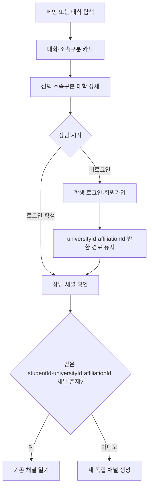
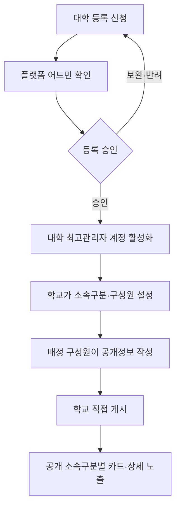
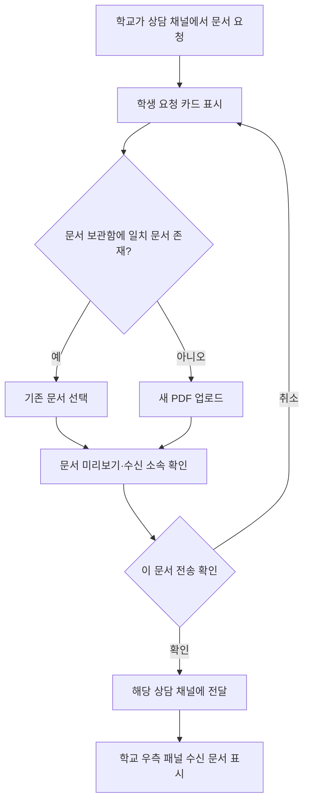
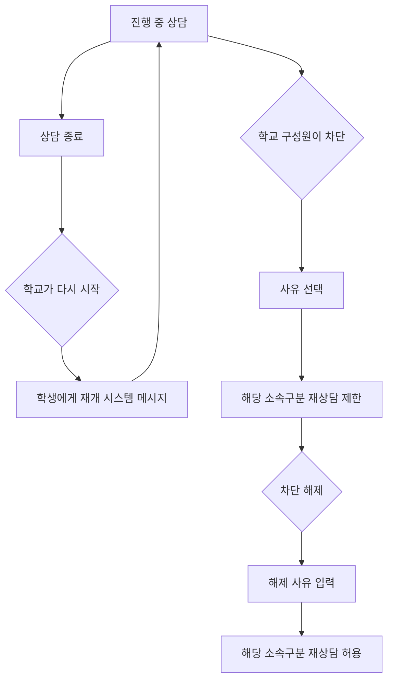
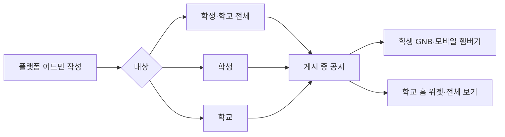

# UBIChat 공통 IA·플로우

## 1. 화면 IA

```text
UBIChat
├─ 공개 서비스
│  ├─ 메인: index.html
│  ├─ 대학 탐색: university-explore.html
│  ├─ 대학 상세: university-detail.html?universityId={id}&affiliationId={id}
│  ├─ 콘텐츠: content.html
│  ├─ FAQ: faq.html
│  ├─ 학생 로그인: login.html
│  └─ 학생 회원가입: signup.html
├─ 학생 포털: student-desktop.html
│  ├─ 내 상담
│  ├─ 공지사항
│  ├─ 문서 보관함
│  └─ 마이페이지
├─ 학교 운영: university-admin.html
│  ├─ 대학 등록 신청·로그인
│  ├─ 홈
│  ├─ 상담 인박스
│  ├─ 조직·멤버 관리
│  ├─ 대학 운영 관리
│  └─ 플랫폼 공지사항
└─ 플랫폼 어드민: platform-admin.html
   ├─ 대시보드
   ├─ 등록 대학·대학 승인
   ├─ 미등록 대학 요청
   ├─ 계정 관리
   ├─ 콘텐츠 CMS
   ├─ 공지사항
   ├─ 광고 구좌
   └─ 활동 이력
```

`student-mobile.html`은 기존 URL 호환용이며 통합 반응형 `student-desktop.html`로 이동한다.

## 2. 공개 탐색에서 상담 시작



## 3. 대학 등록과 공개정보 게시



- 플랫폼 어드민은 대학 등록을 승인한다.
- 공개정보와 자산 게시에는 어드민 사전 승인이 없다.
- 프로토타입은 고정 더미 데이터를 공개 화면에서 사용한다.

## 4. 문서 요청과 전달



학교가 `재요청하기`를 실행하면 학생에게 업로드 상자와 기존 문서 선택이 다시 나타난다. 재전송 뒤 학교 패널은 `업데이트됨`과 빨간 점을 표시한다.

## 5. 상담 종료·재개·차단



차단 사유는 `광고성 채팅`, `어뷰징 유저`, `기타`다. `기타`만 상세 사유를 필수 입력한다.

## 6. 플랫폼 공지



- 공지 GNB 진입은 공개할 수 있다.
- 공지 본문은 로그인 후 자기 대상만 열람한다.
- 중요 공지는 대상 목록 최상단에 표시한다.
- 종료는 삭제가 아니라 `hidden` 전환이다.

## 7. URL·상태 유지

- 대학 상세: `universityId + affiliationId`
- 상담 반환: `universityId + affiliationId + returnTo`
- 학생 포털: `student-desktop.html?view=chats|notices|docs|my`
- 로그인 전 선택한 대학·소속구분은 로그인·회원가입 뒤에도 유지한다.
- 모든 UBIChat 로고 목적지는 `index.html`이다.

