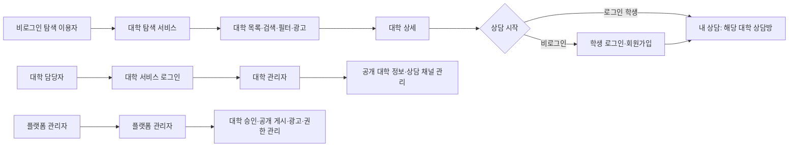
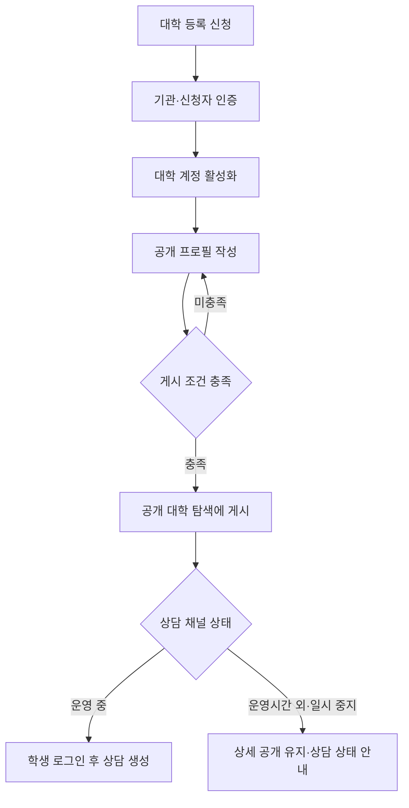

# 회원 스쿼드별 IA·플로우·정책 개선안

기준일: 2026-07-21  
목표: 랜딩페이지를 비로그인 학생도 이용하는 **대학 탐색 서비스 홈**으로 정의하고, 상담·대학 운영·플랫폼 운영을 역할별 서비스로 분리한다.

## 1. 목표 IA





## 2. 역할별 목표 서비스

| 스쿼드 | 서비스 목적 | 로그인 전 | 로그인 후 | 이번 수정의 핵심 |
|---|---|---|---|---|
| 학생 | 대학 탐색과 상담 관리 | 대학 탐색·대학 상세·광고 열람 | 대학 탐색, 내 상담, 문서 보관함, 마이페이지 | 기존 `대학 찾기`를 공개 탐색으로 흡수 |
| 대학 | 대학 정보와 상담 운영 | 대학 서비스 소개·등록 신청 | 상담 인박스, 공개 프로필, 멤버, 통계 | `학생 노출`을 `공개 탐색 게시`로 재정의 |
| 플랫폼 관리자 | 기관 검증과 플랫폼 운영 | 별도 진입 | 승인, 공개 게시, 계정·권한, 광고 구좌 | 계정·프로필·상담 상태를 분리 관리 |

## 3. 학생 스쿼드

### 목표 GNB

```text
비로그인: 유학상담 | 대학 탐색 | 대학 서비스 | 로그인
로그인 학생: 유학상담 | 대학 탐색 | 내 상담 | 콘텐츠 | 학생 계정 메뉴
```

`대학 탐색`은 학생 포털 내부의 별도 화면이 아니라 공개 탐색 서비스로 연결한다. 기존 학생 포털에서는 `내 상담`, `문서 보관함`, `마이페이지`를 유지한다.
축소 화면은 페이지 메뉴, 학생 이름·이메일, `공지사항·문서 보관함·마이페이지·로그아웃`, 다국어 선택을 햄버거 하나에 통합한다.

### 수정 대상

- `student-desktop.html`: `pFind`와 `ST-1 대학 찾기` 시나리오 제거 또는 공개 탐색으로 리디렉션한다.
- `student-mobile.html`: `vFind`와 모바일 탐색 탭을 제거하고, 하단 탭은 `내 상담 · 문서 · 마이`로 유지한다.
- 일반 학생 로그인 후 기본 화면은 `내 상담`으로 이동한다.
- 대학 상세에서 시작한 로그인은 선택한 `universityId`를 유지해 해당 대학의 상담방을 생성하거나 기존 상담방을 연다.
- `대화 이어하기` 여부는 대학 카드의 상태가 아니라 `studentId + universityId` 기반 상담 건 상태로 판단한다.

### 학생 권한 정책

| 기능 | 비로그인 | 로그인 학생 |
|---|---:|---:|
| 대학 검색·필터·목록·상세 | 가능 | 가능 |
| 광고 열람 | 가능 | 가능 |
| 상담 시작·메시지 전송 | 불가 | 가능 |
| 내 상담·문서 보관함·마이페이지 | 불가 | 가능 |
| 미등록 대학 요청 | 불가 권장 | 가능 |

미등록 대학 요청은 알림 발송, 중복 병합, 스팸 방지가 필요하므로 학생 로그인 후 기능으로 유지한다.

## 4. 대학 스쿼드

### 목표 IA

```text
대학 서비스
├─ 상담 관리
│  └─ 인박스
├─ 공개 대학 정보 관리
│  ├─ 기본 정보·소개
│  ├─ 분야·모집 정보
│  ├─ 브로셔·이미지
│  ├─ 상담 운영 시간·상담 상태
│  ├─ 공개 상세 미리보기
│  └─ 게시 상태
├─ 멤버 관리
└─ 성과
   ├─ 공개 탐색 유입·상세 조회
   └─ 상담 신청·응답 통계
```

### 용어 변경

| 기존 | 변경 |
|---|---|
| 학생 노출 대학 정보 | 공개 탐색 대학 정보 |
| 학생에게 노출 중 | 대학 탐색에 게시 중 |
| 학생 화면 미리보기 | 공개 대학 상세 미리보기 |
| 학생 노출 | 공개 탐색 노출 |

대학 등록 승인만으로 공개 게시하지 않는다. 승인 후 대학이 프로필을 작성하고 게시 조건을 충족해야 공개 탐색에 보인다.

## 5. 플랫폼 관리자 스쿼드

### 목표 IA

```text
플랫폼 관리자
├─ 운영 대시보드
├─ 대학 온보딩
│  ├─ 등록 신청 승인
│  └─ 보완·반려 처리
├─ 공개 대학 관리
│  ├─ 공개 프로필·게시 상태
│  ├─ 상담 채널 상태
│  └─ 변경 이력
├─ 대학 수요 요청
├─ 광고 구좌 관리
│  ├─ 대학 상단 배너
│  └─ 기업 제휴 배너
└─ 계정·권한 관리
```

대학 계정 정지와 공개 게시 중지, 상담 채널 중지는 독립적으로 관리한다. 기관 폐쇄·제재 같은 예외 상황에서만 세 상태를 함께 중지한다.

## 6. 공통 대학 데이터 정책

### 공통 식별자

대학명 문자열 대신 `universityId`를 공통 키로 사용한다. 공개 목록, 상세, 상담, 대학 관리자, 플랫폼 관리자는 모두 이 식별자를 참조한다.

### 상태 분리

| 상태 | 값 예시 | 의미 |
|---|---|---|
| `publication.status` | 초안, 검토 중, 게시, 숨김 | 공개 탐색·대학 상세에 보이는지 |
| `consultation.status` | 운영 중, 운영시간 외, 일시 중지 | 상담 CTA와 응답 가능 여부 |
| `account.status` | 활성, 정지, 해지 | 대학 관리자 로그인 가능 여부 |
| 상담 건 상태 | 대기, 진행 중, 종료 | 특정 학생과 대학의 상담 관계 |

공개 프로필이 게시되어도 상담 채널은 일시 중지될 수 있으며, 이 경우 대학 상세는 유지하고 상담 가능 상태를 명확히 안내한다.

### 공통 데이터 필드

```text
University
├─ id, 국문·영문명, 지역, 분야
├─ 로고·대표 이미지
├─ 한 줄 소개·상세 소개·브로셔
├─ publication.status
├─ consultation.status·응답 시간·운영 시간·상담 언어
└─ account.status
```

현재 목업에서는 `university-data.js`가 공개 대학 데이터의 기준 소스다. 공개 랜딩, 전체 대학 탐색, 대학 상세는 이 파일을 함께 읽는다.

## 7. 실행 순서

1. 공통 대학 데이터 통합 및 공개 화면 반영
2. 학생 데스크톱·모바일에서 중복 `대학 찾기` 제거, 로그인 후 기본 화면을 `내 상담`으로 변경
3. 대학 관리자에서 공개 대학 정보·게시 상태를 관리하도록 IA와 용어 변경
4. 플랫폼 관리자에서 대학 승인, 공개 게시, 상담 채널, 광고 구좌를 분리 관리
5. 비로그인 탐색 → 로그인 → 상담 생성과 대학 등록 → 게시 → 탐색 노출 시나리오 검증

## 8. 확인이 필요한 운영 결정

- 기존 관리 화면에 표시된 `미노출 3개 대학`의 실제 대상과 공개 정책
- 상담 운영시간 외에도 새 상담 신청을 받아 대기열을 만들지 여부
- 대학 등록 요청을 학생 로그인 후에만 받을지, 비로그인 요청도 허용할지
- 공개 프로필 게시를 대학 자체 게시로 할지, 관리자 검토 후 게시로 할지
